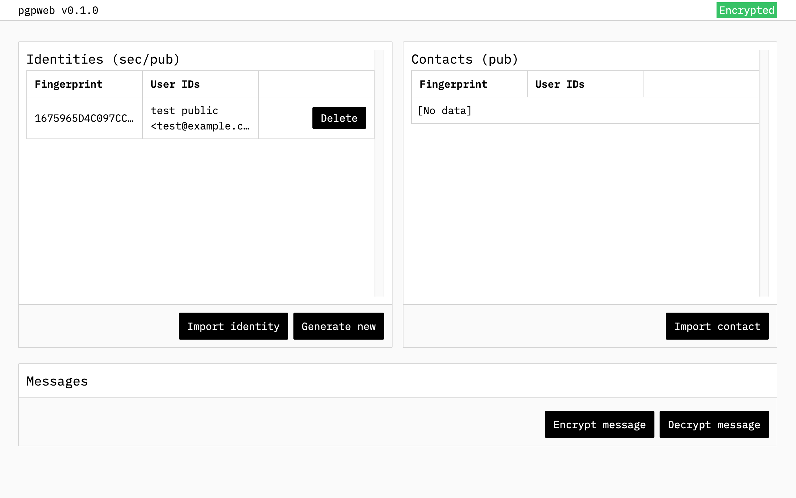

# pgpweb

> [!WARNING]
> Please do not use your real keys yet. This project hasn't been tested properly.

A web application designed to simplify PGP usage.

## Features

- Local storage encryption
- Key import
- Key generation
- Message en-/decryption

## Usage

### Starting the project

1. Clone the project
2. `npm install`
3. `npm run dev`
